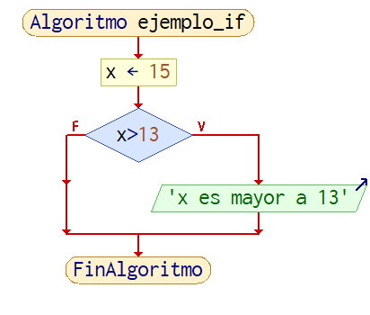
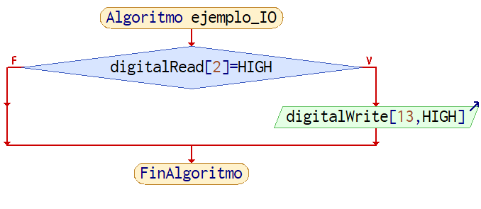
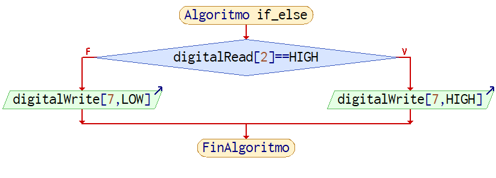
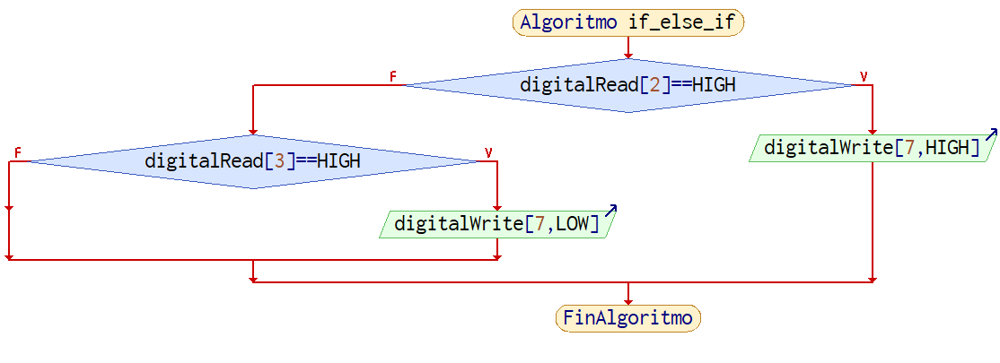
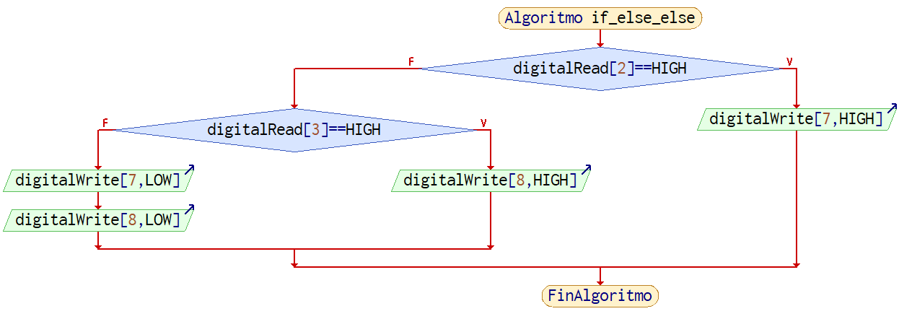
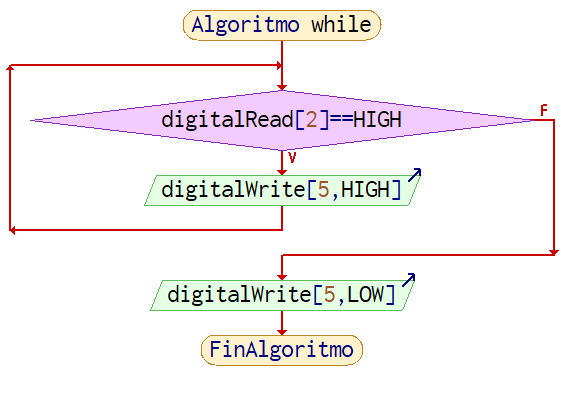
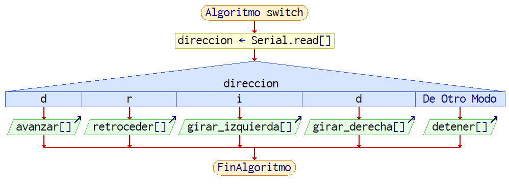

# Bucles de Control
Los bucles de control permiten redirigir el flujo de un programa bajo ciertas condiciones.

!!! info "Informacion"
    Para entender mejor esta seccion, vease [Funciones Basicas en Arduino](Funciones%20Basicas.md)
    
## Bucles propios del arduino
Arduino tiene en todos los proyectos dos funciones que funcionan a modo de bucles de control, uno llamado `setup` y otro llamado `loop`

!!! warning "Advertencia"
    ambos bucles deben estar presentes en el sketch de arduino y no pueden repetirse, si faltaran o se repitieran el IDE se rehusara a compilar el sketch

```arduino
/*  cuando se crea un sketch nuevo, asi 
    es como se ve en el IDE
*/
void setup() {
  // put your setup code here, to run once:

}

void loop() {
  // put your main code here, to run repeatedly:

}
```

### `setup`
El bucle de control `setup` solo corre una vez cada que se energiza el arduino o se reinicia, generalmente se usa para configurar pines, inicializar buses de comunicacion y enlazar el Arduino con servomotores, entre otras cosas.

```arduino
void setup() {
    Serial.begin(9600); // inicializar Serial
    servo1.attach(3);   // enlazar servomotor
    pinMode(3, OUTPUT); // declarar pines como salida o entrada
}
```

### `loop`
una vez el program llega al bucle de control `loop` el Arduino repetira lo que sea que este en el de manera indefinida y no saldra de este bucle a no ser que se lo fuerce a salir de este en situaciones especiales, por lo general aqui es donde la gran parte de los programas se escribe.

```arduino
/*  este bucle enciende el pin 13 por 1 segundo
    y luego lo vuelve a apagar por 1 segundo
*/
void loop() {  
  digitalWrite(13, HIGH);   
  delay(1000);                       
  digitalWrite(13, LOW);    
  delay(1000);               
}
```

## `if` / `if..else`
### `if`
Este bucle de control se usa para ejecutar codigo cuando alguna condicion que se especifique se cumpla.
#### Ejemplo 1

```arduino
// se asigna 13 a un entero, al que llamaremos x
int x = 15;
// se verifica si 15 es mayor a 13, si es verdad se muestra una String por el monitor serial
if(x > 13) {
    Serial.println("x es mayor a 13");
}
```



#### Ejemplo 2

```arduino
/*  este bucle enciende el pin 13 si mandamos una señal de 5V(HIGH) al pin 2
    dentro de
*/
if (digitalread(2) == HIGH) {
    digitalWrite(13, HIGH); // no se olviden del punto y la coma
}
```



### `if..else`
se puede usar `else` cuando se quiere hacer algo en caso de que la condicion analizada en el `if` sea falsa
#### Ejemplo 1

```arduino
// se tiene un boton en el pin 2, si llega una señal de HIGH se enciende un LED en el pin 7, si esta no se recibe, el LED se apaga
if(digitalRead(2) == HIGH)
{
    digitalWrite(7, HIGH); // encendemos un led en el pin 7
}
else
{
    digitalWrite(7, LOW); // apagamos led en el pin 7
}
```



cuando se necesita abarcar mas casos de condicionales, o cuando se quiere hacer otra cosa en caso de que una primera no se cumpla, se puede usar `if` de nuevo despues de un else, que permite añadir otra condicional al bucle.

#### Ejemplo 2

```arduino
// se hace algo igual a lo anterior, solo que esta vez una lectura en otro pin apagara el led en lugar de que dejar de apretar el boton lo apague
if(digitalRead(2) == HIGH)
{
    digitalWrite(7, HIGH); // encendemos un led en el pin 7
}
else if (digitalRead(3) == HIGH)
{
    digitalWrite(7, LOW); // apagamos led en el pin 7
}
```


en algunas ocasiones se puede incluir un `else` al final que se ejecutara si es que ninguno de los `if`'s anteriores resultaron verdaderos:
#### Ejemplo 3

```arduino
/*  imaginemos dos botones, uno en el pin 2 y
    otro em el pin 3, y dos lEDs, uno en el pin
    7 y otro en el pin 8
*/
// si presionamos el boton en el pin 2
if(digitalRead(2) == HIGH)
{
    digitalWrite(7, HIGH); // encendemos un led en el pin 7
}
// si el boton 2 no esta presionado, procedemos a ver si el pin 3 esta presionado
else if (digitalRead(3) == HIGH)
{
    digitalWrite(8, HIGH); // encendemos otro en el pin 8
}
// finalmente si ninguno de los botones esta presionado
else
{
    // apagamos todos los LEDs
    digitalWrite(7, LOW);
    digitalWrite(8, LOW);
}
```


## `for`
el ciclo `for` se utiliza para repetir partes de codigo un determinado numero de veces, para funcionar, necesita 3 partes en este orden:

- **Una variable de control**, la cual se ocupa por lo general para controlar cuantas veces se repetira el ciclo, comunmente se suele usar un entero llamado `i`.
- **Una condicion de salida**, el ciclo continuara ejecutandose hasta que la condicion de salida ya no se cumpla
- **Un parametro de incremento**, cada que se termine de ejecutar el bucle este parametro incrementara o configurara la variable de control

#### Ejemplo 1
```arduino
/*  se tienen 4 leds en fila desde el pin 4, 
    hasta el pin 7, este ciclo for
    los enciende en secuencia
*/
for (int i = 4, i < 8, i++) {
    /*  dentro del bucle se puede 
        usar la variable "i"
        para automatizar tareas,
        en este caso se usara para 
        designar el pin del led al que
        se mandara una salida
    */
    digitalWrite(i, HIGH);
    // 1 segundo de espera
    delay(1000);
    /*  al salir del bucle se
        ejecuta el parametro
        de incremento, en este
        caso, la variable "i"
        se incrementa en 1
    */
}
```

## `while`
el ciclo `while` ejecutara una parte de codigo de manera indefinida hasta que determinada condicion de salida se cumpla

#### Ejemplo 1
```arduino
/*  se tiene un boton en el pin 2
    y unled en el pin 5, mientras
    el boton este presionado el
    LED seguira encendido,
*/
while(digitalRead(2) == HIGH)
{
    digitalWrite(5,HIGH);
}
/*  al salir del bucle, el
    led se apagara
*/
digitalWrite(5, LOW);
```


## `switch`
Bastante similar al `if`, `switch` controla que porciones de codigo se pueden ejecutar segun una condicion. La diferencia es que switch solo admite caracteres `char` y numeros enteros `int`

#### Ejemplo 1
```arduino
/*  Se tiene un auto a control remoto
    y esta es la funcion de control,
    para controlar la direccion usa 
    un char que llega de la conexion 
    bluetooth.

    El auto tiene librerias 
    preconfiguradas para avanzar,
    retroceder, etc.
*/

char direccion = Serial.read();
switch (direccion) {
    case 'd':
        avanzar();
    break;
    case 'r':
        retroceder();
    break;
    case 'i':
        girar_izquierda();
    break;
    case 'd':
        girar_derecha();
    break;
    default:
        detener();
    break;
}
```

