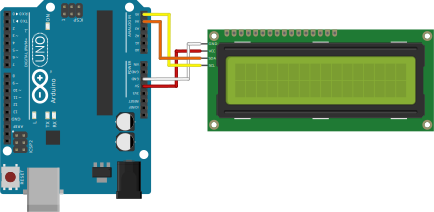

# Pantalla de 16x2 con Modulo I2C
las pantallas LCD 


### Uso basico



=== "Variables"

    ```arduino
    int velocidad = 128;
    ```

=== "Setup"

    ```arduino
    void setup() {
        pinMode(3, OUTPUT);
        pinMode(4, OUTPUT); 
        pinMode(5, OUTPUT); 
    }
    ```

=== "Loop"

    ```arduino
    void loop() {
        analogWrite(3, velocidad);
        digitalWrite(4, HIGH);
        digitalWrite(5, LOW);
        delay(1000);

        analogWrite(3, velocidad);
        digitalWrite(4, LOW);
        digitalWrite(5, HIGH);
        delay(1000);
    }
    ```

