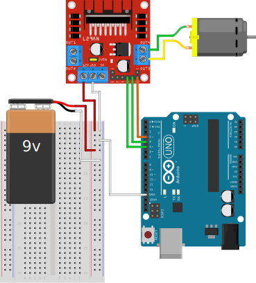
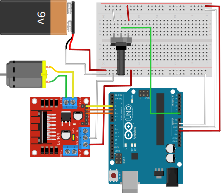
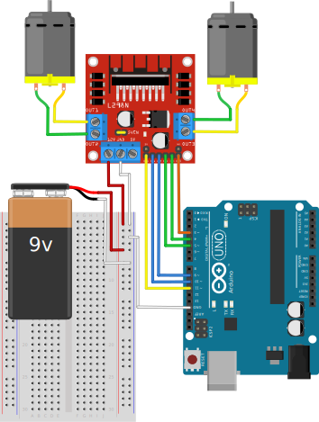

# Puentes H
Si bien el arduino es capaz de mover motores DC de pequeño tamaño, no esta diseñado para esta tarea por la poca potencia que maneja en sus puertos, en su lugar, se ocupa otro chip que es capaz de manejar la corriente necesaria para esto, uno de esos chips son los puentes H. Los mas comunes son

- L293D
- L298N
- A4988 y similares

## L293 y L298
estos puentes h son de bajo costo, controlan 2 motores como maximo y se conectan de manera similar


### Control
Para cada motor se tiene un juego de 3 pines:
- **Enable**, marcado como `ENA, ENB`, estos pines controlan la velocidad de cada motor segun el voltaje de entrada, a 0V el motor se detiene por completo, a 5V el motor avanza a la velocidad maxima.
- **Pines de entrada**, Estos pines definen el sentido de la corriente en el motor, `IN1` corrsponde a `OUT1`, `IN2` corrsponde a `OUT2` y asi sucesivamente. Cada par de entradas corrsponde a un solo motor. 

### Voltaje
en la placa hay un jumper que controla un regulador de 5V y se puede usar de dos modos:
- Cuando el voltaje que se va a usar es menor a 12V, se introduce este voltaje por los pines de `12V` y `GND`, **con el jumper puesto se puede usar la entrada de `5V` como una salida de voltaje para alimentar otros elemenos**, como el Arduino
- Cuando el voltaje que se va a usar es mayor a 12V, se introduce este voltaje por los pines de 12V y GND, **el jumper se debe remover para desactivar el regulador, y se debe introducir por la entrada de 5V otro voltaje para alimentar el `L298`**.

## Uso Basico
### Ejemplo: Giro



=== "Variables"

    ```arduino
    int velocidad = 128;
    ```

=== "Setup"

    ```arduino
    void setup() {
        pinMode(3, OUTPUT);
        pinMode(4, OUTPUT); 
        pinMode(5, OUTPUT); 
    }
    ```

=== "Loop"

    ```arduino
    void loop() {
        analogWrite(3, velocidad);
        digitalWrite(4, HIGH);
        digitalWrite(5, LOW);
        delay(1000);

        analogWrite(3, velocidad);
        digitalWrite(4, LOW);
        digitalWrite(5, HIGH);
        delay(1000);
    }
    ```

### Ejemplo: Aceleracion

[Mismo esquematico del ejemplo anterior](#ejemplo-giro), la diferencia es que el motor va acelerando y decelerando

=== "Setup"

    ```arduino
    void setup() {
        pinMode(3, OUTPUT);
        pinMode(4, OUTPUT); 
        pinMode(5, OUTPUT); 
    }
    ```

=== "Loop"

    ```arduino
    void loop() {
        for( int i = 0; i < 256; i++ )
        {
            analogWrite(3, i);
            digitalWrite(4, HIGH);
            digitalWrite(4, LOW);
            delay(50);
        }

        for( int i = 255; i > 0; i-- )
        {
            analogWrite(3, i);
            digitalWrite(4, LOW);
            digitalWrite(4, HIGH);
            delay(50);
        }
    }
    ```

### Ejemplo: Controlado por Potenciometro



=== "Variables"

    ```arduino
    int velocidad = 0;
    ```

=== "Setup"

    ```arduino
    void setup() {
        pinMode(3, OUTPUT);
        pinMode(4, OUTPUT); 
        pinMode(5, OUTPUT); 
        pinMode(A0, INPUT);
    }
    ```

=== "Loop"

    ```arduino
    void loop() {
        velocidad = map(analogRead(A0), 0, 1024, 0, 255);
        analogWrite(3, velocidad);
        digitalWrite(4, HIGH);
        digitalWrite(5, LOW);
    }
    ```

### Ejemplo: Dos Motores



=== "Variables"

    ```arduino
    int velocidad = 128;
    ```

=== "Setup"

    ```arduino
    void setup() {
        pinMode(3, OUTPUT);
        pinMode(4, OUTPUT); 
        pinMode(5, OUTPUT); 
    }
    ```

=== "Loop"

    ```arduino
    void loop() {
        analogWrite(3, velocidad);
        digitalWrite(4, HIGH);
        digitalWrite(5, LOW);
    }
    ```

## Uso con Funciones
### Funcion `motorl298`
Usando [el primer Esquematico](#ejemplo-giro):

=== "Variables"

    ```arduino
    #define ADELANTE 1
    #define DETRAS 2
    #define PARO 3
    void motorl298(int sentido, int velocidad = 450) {
        switch (sentido) {
            case ADELANTE:
                digitalWrite(4, HIGH);
                digitalWrite(5, LOW);
                analogWrite(3, velocidad);
            break;
                case DETRAS:
                digitalWrite(4, LOW);
                digitalWrite(5, HIGH);
                analogWrite(3, velocidad);
            break;
            case PARO:
                digitalWrite(4, LOW);
                digitalWrite(5, LOW);
            break;
        }
    }
    ```

=== "Setup"

    ```arduino
    void setup() {
        pinMode(3, OUTPUT);
        pinMode(4, OUTPUT); 
        pinMode(5, OUTPUT); 
    }
    ```

=== "Loop"

    ```arduino
    void loop() {
        motorl298(1, 128);
        delay(1000);
        motorl298(DETRAS, 255);
        delay(1000);
        motorl298(PARO);
        delay(1000);
    }
    ```

### Objeto `l298n.h`
Usando [el primer Esquematico](#ejemplo-giro):

=== "`l298.h`"

    ```arduino
    #ifndef L298_H
    #define L298_H
    #include <Arduino.h>
    class l298 {
    private:
        int enable_pin;
        int in1_pin;
        int in2_pin;
    public:
        l298(int enable_pin, int in1, int in2);
        void habilitar();
        
        void avanzar(int velocidad);
        void retroceder(int velocidad);
        void detener();
    };
    #endif
    ```

=== "`l298.cpp`"

    ```arduino
    #include "l298.h"
    l298::l298(int enable_pin, int in1, int in2) {
        this -> enable_pin = enable_pin;
        this -> in1_pin = in1;
        this -> in2_pin = in2;
    }

    void l298::habilitar() {
        pinMode(enable_pin, OUTPUT);
        pinMode(in1_pin, OUTPUT);
        pinMode(in2_pin, OUTPUT);
    }

    void l298::avanzar(int velocidad) {
        digitalWrite(in1_pin, HIGH);
        digitalWrite(in1_pin, LOW);
        analogWrite(enable_pin, velocidad);
    }

    void l298::retroceder(int velocidad) {
        digitalWrite(in1_pin, LOW);
        digitalWrite(in1_pin, HIGH);
        analogWrite(enable_pin, velocidad);
    }

    void l298::detener() {
        digitalWrite(in1_pin, LOW);
        digitalWrite(in1_pin, LOW);
        analogWrite(enable_pin, 0);
    }
    ```

=== "Sketch"

    ```arduino
    #include "l298.h"

    l298 motor_de_juguete(3, 4, 5);

    void setup() {
        motor_de_juguete.habilitar();
    }

    void loop() {
        for (int i = 0; i < 256; i++) {
            motor_de_juguete.avanzar(i);
            delay(50);
        }

        motor_de_juguete.detener();
        delay(1000);

        for (int i = 255; i > 0; i++) {
            motor_de_juguete.retroceder(i);
            delay(50);
        }

        motor_de_juguete.detener();
        delay(1000);
    }
    ```
